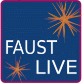

FaustLive
============================
## The swiss knife for [Faust](https://faust.grame.fr) development.
--------------

FaustLive is an advanced self-contained prototyping environment for the Faust programming language with an ultra-short edit-compile-run cycle. Thanks to its fully embedded compilation chain, FaustLive is simple to install and doesn't require any external compiler, development toolchain or SDK to run. 

FaustLive is the ideal tool for fast prototyping. Faust programs can be compiled and run on the fly by simple drag and drop. They can even be edited and recompiled while running, without sound interruption.
It supports also native applications generation using the [Faust online compiler](https://faust.grame.fr/tools/onlinecompiler/).

FaustLive is based on the [Faust](https://faust.grame.fr) library and on [LLVM](http://llvm.org).

## Libraries

Faust libraries are now in a [separated subproject](https://github.com/grame-cncm/faustlibraries). They are synchronized from time to time in the main FaustLive repository using the following commands:

    git submodule update --remote --merge
    git add Resources/Libs
    git commit -m "Updating libraries"
    git push

### Limitations and known bugs

 - crashes on Windows when compiling a dsp with input signals, on a machine without input audio device
 - may crash on startup due to incorrect cache. In this case, find the `FaustLive-CurrentSession-2.0` folder in your home folder, remove it and restart. On Unix like stations (Linux, MacOS), this folder is hidden and located at `$HOME/.FaustLive-CurrentSession-2.0` 

<!--p align="center">
    
  
</p-->

--------------
#### [Grame](http://www.grame.fr) - Centre National de Creation Musicale
